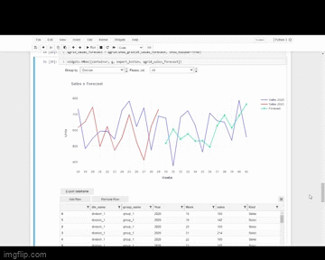

Hi!

I created this repository to show some analysis to compare sales and forecast.

In this notebook I use some libraries like pandas, plotly, qgrid and tkinter.

The big difference lies in the use of ipywidgets combined with the other libraries to make the analysis more dynamic and responsive.

Below is a small demonstration of the notebook.

Any suggestion for improvement is welcome =]